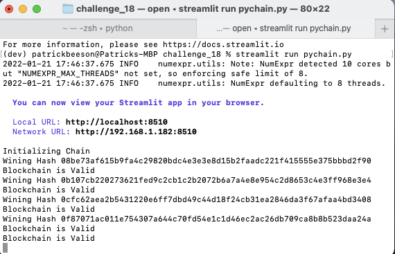
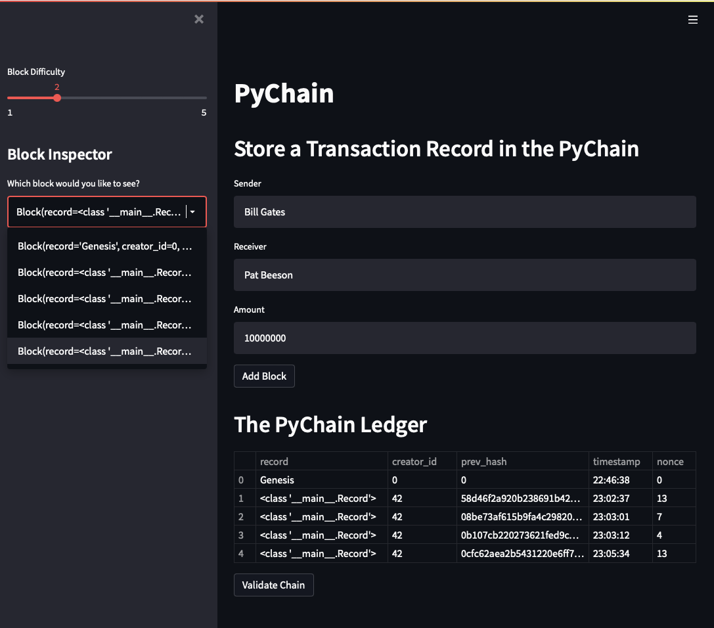
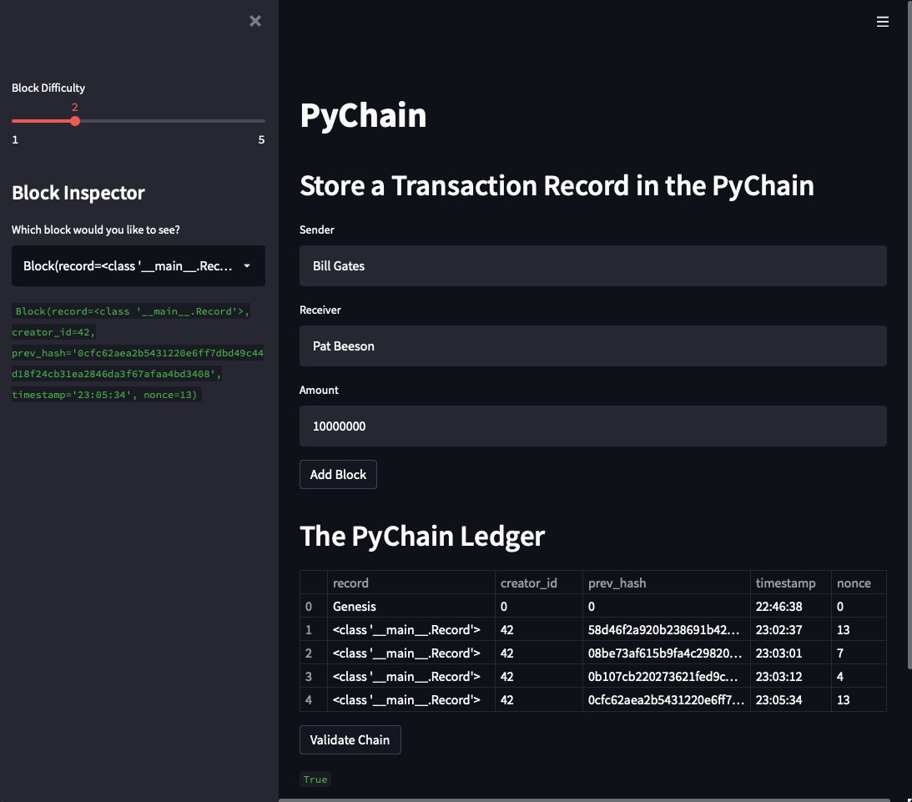

# Module 18 Challenge
This project contains a blockchain-based ledger system, complete with a user-friendly web interface. The ledger allows partner banks to conduct financial transactions and to verify the integrity of the data in the ledger.

The following steps were completed with my usual technical acumen

* Created a Record Data Class
* Modified the Existing Block Data Class to Store Record Data
* Added User Inputs to the Steamlit Interface
* Tested the PyChain Ledger by Storing Records

## Images in Presentation
#### Run the Streamlit application - streamlit run pychain.py


#### Verify the block contents and hashes in the Streamlit drop-down menu


#### Validate the blockchain



____
## Technologies

#### Unique installs required for project
```
pip install streamlit
```

####  Modules
```
# Imports
import streamlit as st
from dataclasses import dataclass
from typing import Any, List
import datetime as datetime
import pandas as pd
import hashlib

```


## License
MIT License

Copyright (c) 2022 patmbee

Permission is hereby granted, free of charge, to any person obtaining a copy
of this software and associated documentation files (the "Software"), to deal
in the Software without restriction, including without limitation the rights
to use, copy, modify, merge, publish, distribute, sublicense, and/or sell
copies of the Software, and to permit persons to whom the Software is
furnished to do so, subject to the following conditions:

The above copyright notice and this permission notice shall be included in all
copies or substantial portions of the Software.

THE SOFTWARE IS PROVIDED "AS IS", WITHOUT WARRANTY OF ANY KIND, EXPRESS OR
IMPLIED, INCLUDING BUT NOT LIMITED TO THE WARRANTIES OF MERCHANTABILITY,
FITNESS FOR A PARTICULAR PURPOSE AND NONINFRINGEMENT. IN NO EVENT SHALL THE
AUTHORS OR COPYRIGHT HOLDERS BE LIABLE FOR ANY CLAIM, DAMAGES OR OTHER
LIABILITY, WHETHER IN AN ACTION OF CONTRACT, TORT OR OTHERWISE, ARISING FROM,
OUT OF OR IN CONNECTION WITH THE SOFTWARE OR THE USE OR OTHER DEALINGS IN THE
SOFTWARE.
