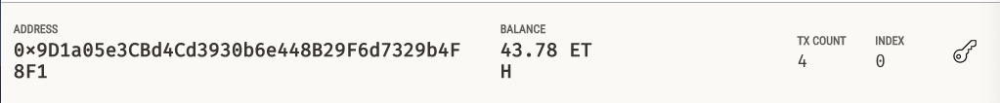

# Module 19 Challenge
This project contains a Fintech Finder application.

*  Generate a new Ethereum account instance by using a mnemonic seed phrase
*  Fetch and display the account balance associated with an Ethereum account address
*  Calculate the total value of an Ethereum transaction, including the gas estimate, that pays a Fintech Finder candidate for their work.
*  Digitally sign a transaction that pays a Fintech Finder candidate, and send this transaction to the Ganache blockchain.
*  Review the transaction hash code associated with the validated blockchain transaction   
*  Navigate to Ganache to review the blockchain transaction details

###  Screenshots of the Fintech Finder Application


#### Ganache Account 


#### Ganache Transaction detail


____
## Technologies

#### Unique installs required for project
```
pip install web3==5.17
pip install mnemonic
pip install bip44
pip install eth-tester==0.5.0b3
```
[Ganache](https://www.trufflesuite.com/ganache)
####  Crytpo Wallet modules
```
import os
import requests
from dotenv import load_dotenv
load_dotenv('SAMPLE.env')
from bip44 import Wallet
from web3 import Account
from web3 import middleware
from web3.gas_strategies.time_based import medium_gas_price_strategy
from web3.auto import w3

```
#### Fintech Finder modules
```
import streamlit as st
from dataclasses import dataclass
from typing import Any, List
```

## License
MIT License

Copyright (c) 2022 patmbee

Permission is hereby granted, free of charge, to any person obtaining a copy
of this software and associated documentation files (the "Software"), to deal
in the Software without restriction, including without limitation the rights
to use, copy, modify, merge, publish, distribute, sublicense, and/or sell
copies of the Software, and to permit persons to whom the Software is
furnished to do so, subject to the following conditions:

The above copyright notice and this permission notice shall be included in all
copies or substantial portions of the Software.

THE SOFTWARE IS PROVIDED "AS IS", WITHOUT WARRANTY OF ANY KIND, EXPRESS OR
IMPLIED, INCLUDING BUT NOT LIMITED TO THE WARRANTIES OF MERCHANTABILITY,
FITNESS FOR A PARTICULAR PURPOSE AND NONINFRINGEMENT. IN NO EVENT SHALL THE
AUTHORS OR COPYRIGHT HOLDERS BE LIABLE FOR ANY CLAIM, DAMAGES OR OTHER
LIABILITY, WHETHER IN AN ACTION OF CONTRACT, TORT OR OTHERWISE, ARISING FROM,
OUT OF OR IN CONNECTION WITH THE SOFTWARE OR THE USE OR OTHER DEALINGS IN THE
SOFTWARE.
