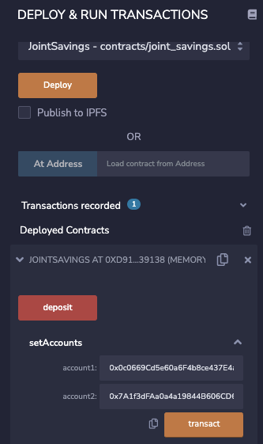
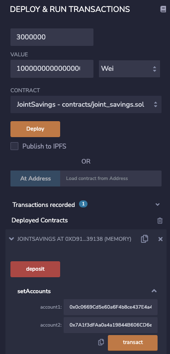
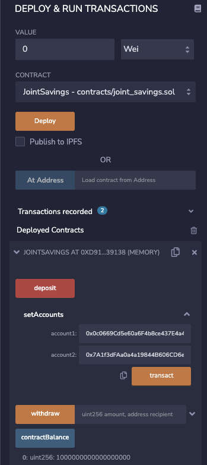
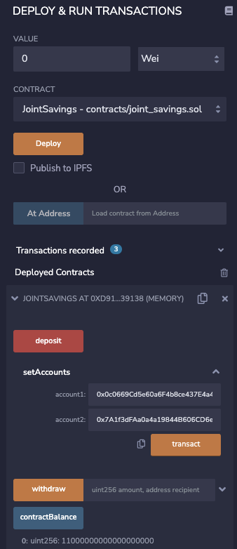
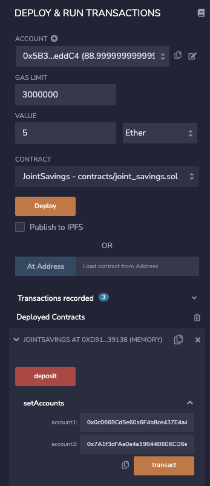
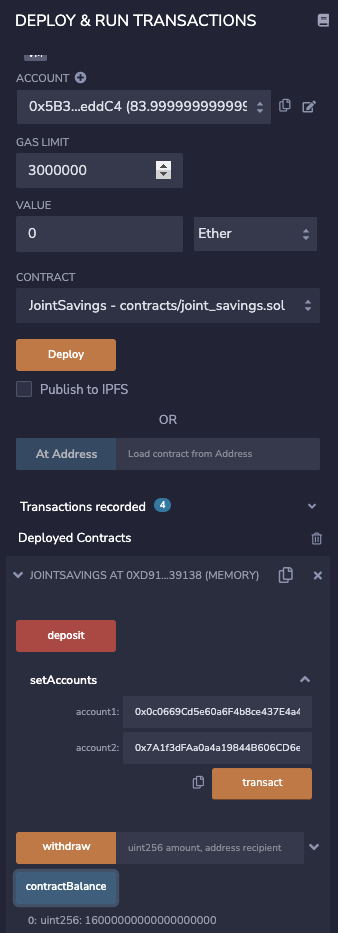
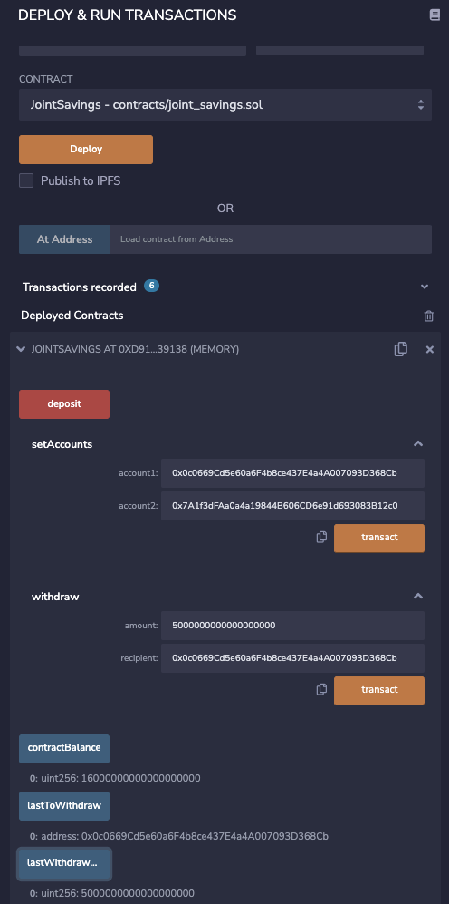
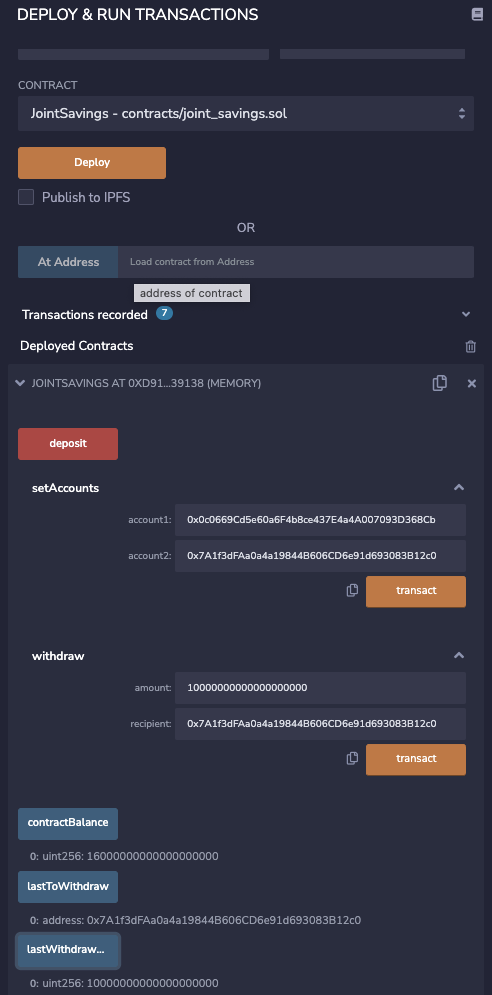

# Module 20 Challenge

## Overview of Project
This project automates the creation of joint savings accounts, using a Solidity smart contract accepting two user addresses. These addresses will be able to control a joint savings account using ether management functions to implement a financial institution’s requirements for providing the features of the joint savings account. These features will consist of the ability to deposit and withdraw funds from the account.

## Requirements
This project uses Solidity 0.5.0 and the Remix IDE which can be accessed via this link: [Remix](https://remix.ethereum.org/)

You many find it helpful to use a Ethereum Unit Converter located here: [Converter](https://eth-converter.com)

##  Screenshots of Remix Joint Savings Contract
### Set Accounts

### 
### Transaction One: Send 1 Ether as Wei - Value

### Transaction Two: 1 Ether as Wei - Contract Balance

### Transaction Two: 10 Ether as Wei - Contract Balance

### Transaction Three: 5 Ether - Value

### Transaction Three: 5 Ether - Contract Balance

### Transaction 4: Withdraw 5 ether as Wei into Account One
 ** Please see the lastToWithdraw and lastWithdraw values

### Transaction 5: Withdraw 10 ether as Wei into Account Two
** Note see lastToWithdraw and lastWithdraw values

## License
MIT License

Copyright (c) 2022 patmbee

Permission is hereby granted, free of charge, to any person obtaining a copy
of this software and associated documentation files (the "Software"), to deal
in the Software without restriction, including without limitation the rights
to use, copy, modify, merge, publish, distribute, sublicense, and/or sell
copies of the Software, and to permit persons to whom the Software is
furnished to do so, subject to the following conditions:

The above copyright notice and this permission notice shall be included in all
copies or substantial portions of the Software.

THE SOFTWARE IS PROVIDED "AS IS", WITHOUT WARRANTY OF ANY KIND, EXPRESS OR
IMPLIED, INCLUDING BUT NOT LIMITED TO THE WARRANTIES OF MERCHANTABILITY,
FITNESS FOR A PARTICULAR PURPOSE AND NONINFRINGEMENT. IN NO EVENT SHALL THE
AUTHORS OR COPYRIGHT HOLDERS BE LIABLE FOR ANY CLAIM, DAMAGES OR OTHER
LIABILITY, WHETHER IN AN ACTION OF CONTRACT, TORT OR OTHERWISE, ARISING FROM,
OUT OF OR IN CONNECTION WITH THE SOFTWARE OR THE USE OR OTHER DEALINGS IN THE
SOFTWARE.
