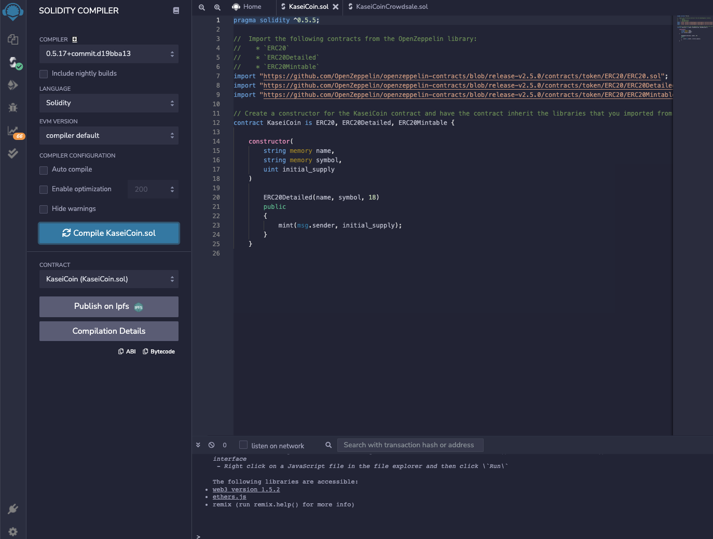
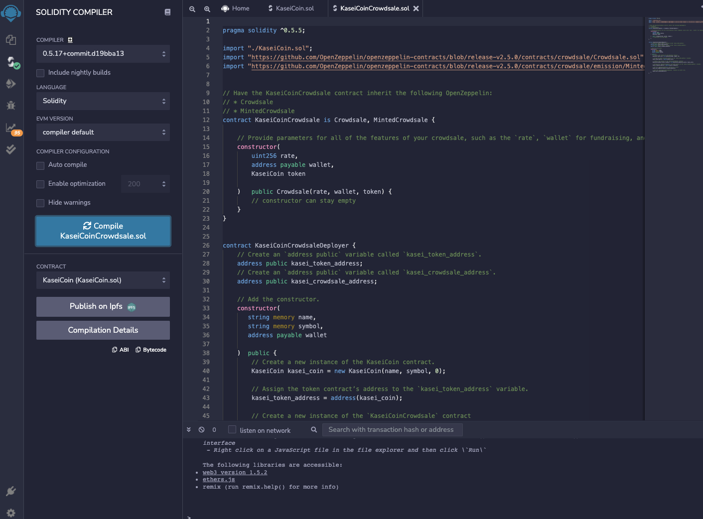
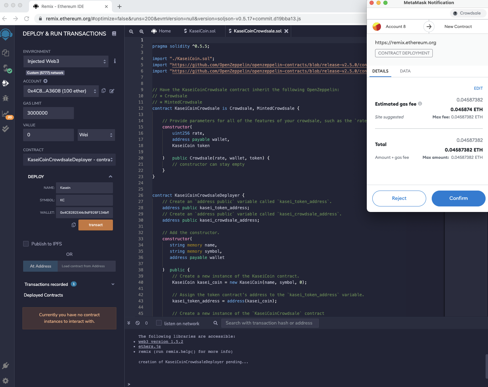
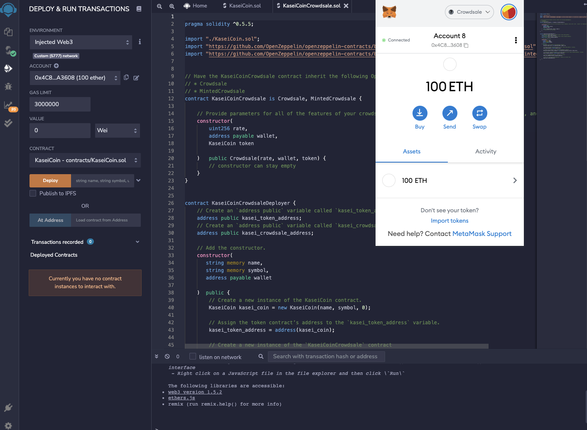
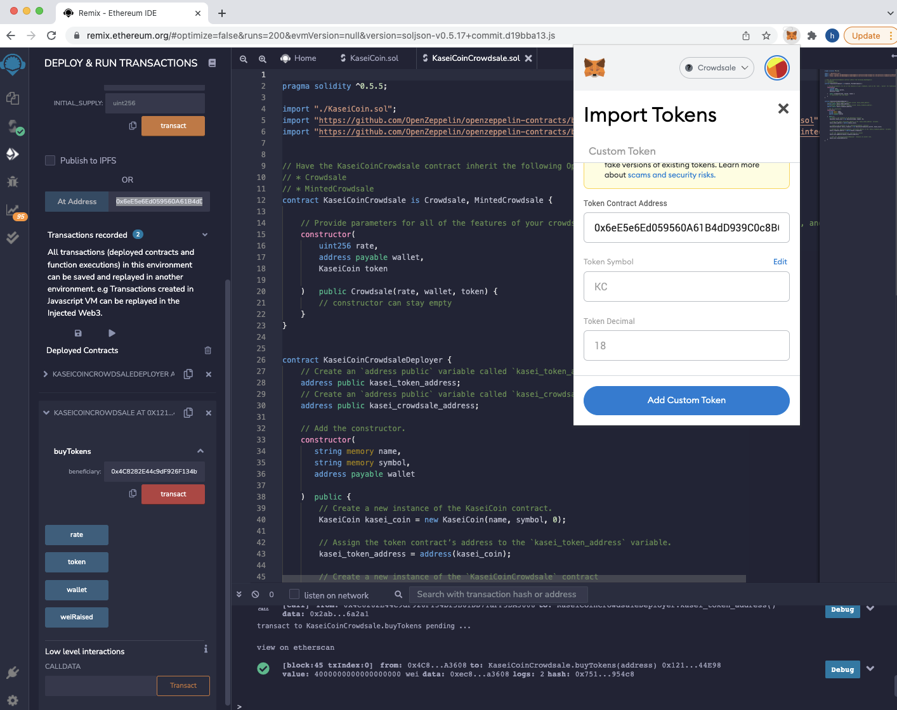
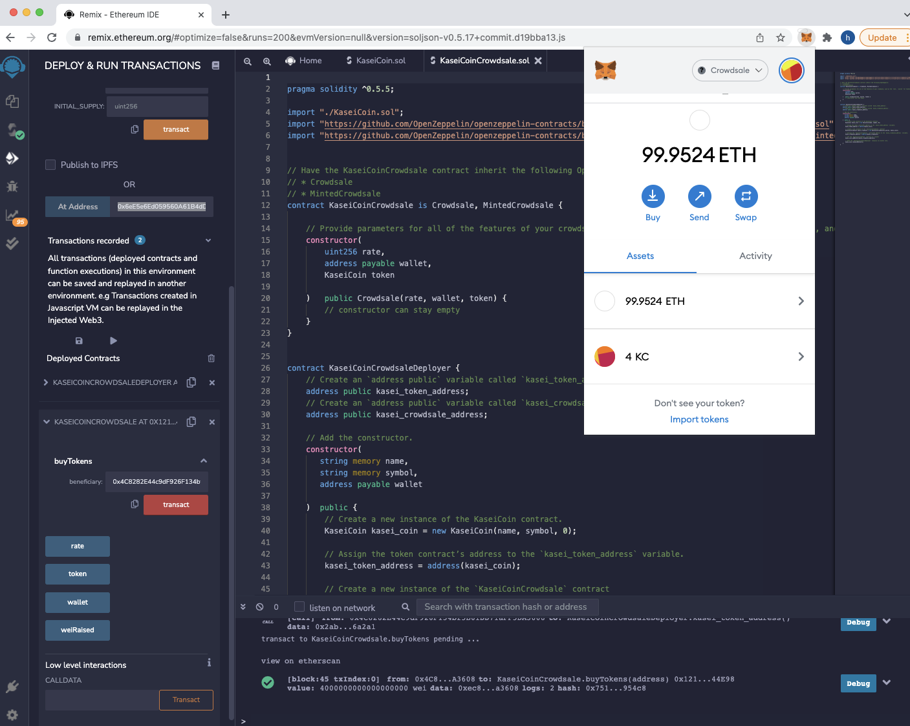
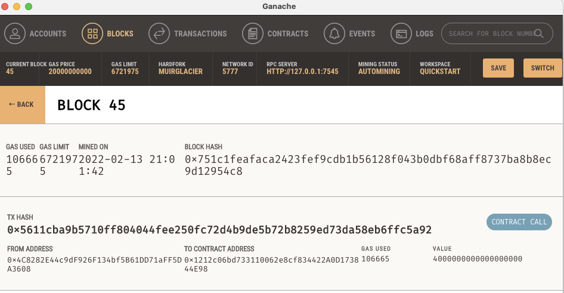
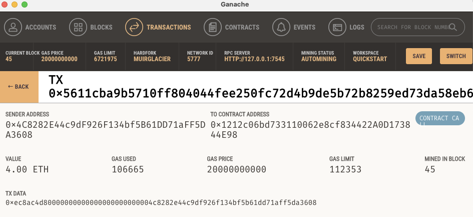
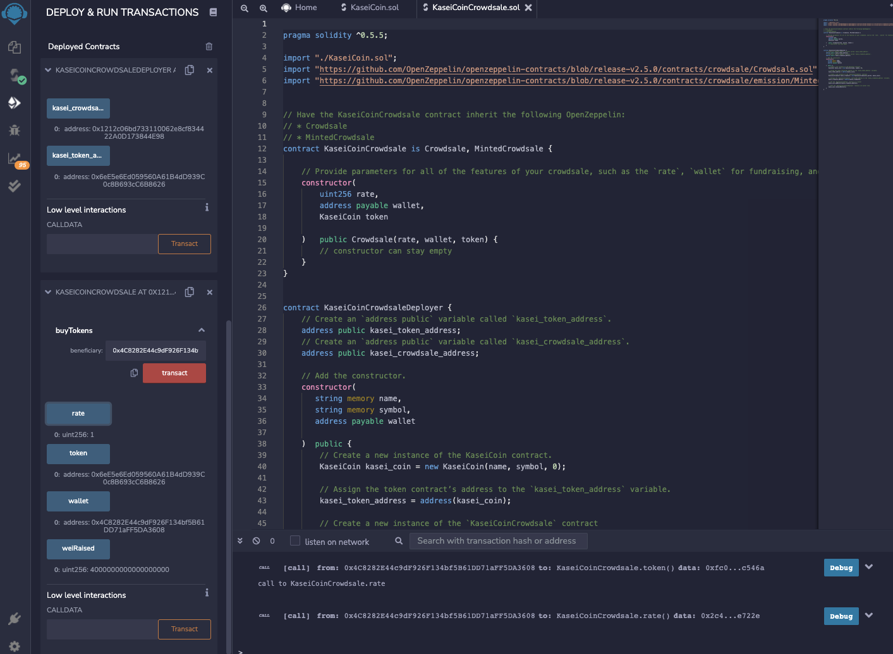

# Module 21 Challenge

## Overview of Project
This projects creates a fungible token that is ERC-20 compliant and that will be minted by using a Crowdsale contract from the OpenZeppelin Solidity library.

This crowdsale contract manages the entire crowdsale process, allowing users to send ether to the contract and in return receive KA, or KaseiCoin tokens. The contract will mint the tokens automatically and distribute them to buyers in one transaction.

## Requirements

* Remix IDE - The remix IDE can be access here: https://remix.ethereum.org
* Solidity - Solidity is an object-oriented, high-level language for implementing smart contracts. Smart contracts are programs which govern   the behaviour of accounts within the Ethereum state.
* MetaMask - A crypto wallet & gateway to blockchain apps
* Ganache - Ganache is a personal blockchain for rapid Ethereum distributed application development. 
* OpenZeppelin - OpenZeppelin is a set of vetted smart contracts. It helps you put precautionary security measures in place for your Web3 apps.

##  Screenshots of Crowdsale
### Compile Coin

### Compile Sale

### Deploy Contract

### Owner

### Import Tokens

### Display Token in Metamask

### Mined Block

### Blockchain Transaction

### Crowdsale Proceeds

## License
MIT License

Copyright (c) 2022 patmbee

Permission is hereby granted, free of charge, to any person obtaining a copy
of this software and associated documentation files (the "Software"), to deal
in the Software without restriction, including without limitation the rights
to use, copy, modify, merge, publish, distribute, sublicense, and/or sell
copies of the Software, and to permit persons to whom the Software is
furnished to do so, subject to the following conditions:

The above copyright notice and this permission notice shall be included in all
copies or substantial portions of the Software.

THE SOFTWARE IS PROVIDED "AS IS", WITHOUT WARRANTY OF ANY KIND, EXPRESS OR
IMPLIED, INCLUDING BUT NOT LIMITED TO THE WARRANTIES OF MERCHANTABILITY,
FITNESS FOR A PARTICULAR PURPOSE AND NONINFRINGEMENT. IN NO EVENT SHALL THE
AUTHORS OR COPYRIGHT HOLDERS BE LIABLE FOR ANY CLAIM, DAMAGES OR OTHER
LIABILITY, WHETHER IN AN ACTION OF CONTRACT, TORT OR OTHERWISE, ARISING FROM,
OUT OF OR IN CONNECTION WITH THE SOFTWARE OR THE USE OR OTHER DEALINGS IN THE
SOFTWARE.
